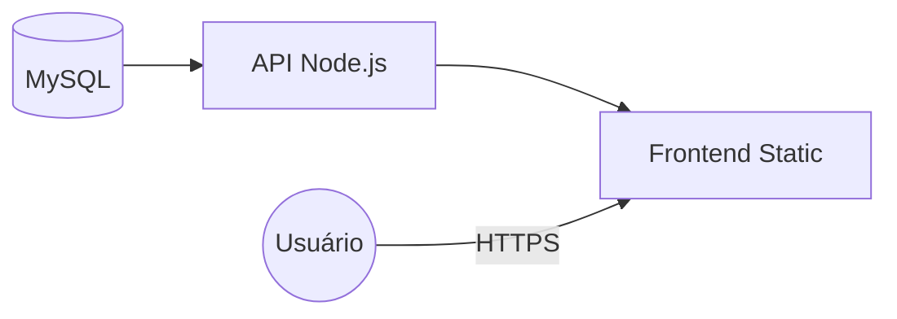

<p align="center">
  
  
  
  
  
</p>

<h1 align="center">VitalHub</h1>

<p align="center">
  Sistema de gestão para clínicas médicas — agendamento, prontuários eletrônicos e controle de acesso por perfil.
</p>

---

## Stack

| Camada | Tecnologias |
|--------|-------------|
| Frontend | React 18, Vite 5, React Router 6, Axios, Recharts, Lucide Icons |
| Backend | Node.js, Express 4, JWT, bcryptjs, Helmet, Rate Limit |
| Database | MySQL 8 (mysql2/promise) |
| Deploy | Railway (MySQL + API + Frontend) |

---

## Estrutura

```
vitalhub/
├── agendafacil-api/        Backend (Node.js + Express)
│   ├── src/controllers/    Lógica de negócio
│   ├── src/routes/         Definição de rotas
│   ├── src/middleware/      Auth + RBAC
│   ├── database/           Schema + Seed SQL
│   └── tests/              Jest + Supertest
│
└── agendafacil-front/      Frontend (React + Vite)
    ├── src/pages/          14 páginas
    ├── src/components/     Componentes reutilizáveis
    ├── src/contexts/       AuthContext
    ├── src/services/       API (Axios)
    └── src/test/           Vitest + Testing Library
```

---

## Setup

### Pré-requisitos
- Node.js 18+
- MySQL 8+

### 1. Banco de Dados

```bash
mysql -u root -p < agendafacil-api/database/schema.sql
mysql -u root -p < agendafacil-api/database/seed.sql
```

### 2. Backend

```bash
cd agendafacil-api
cp .env.example .env     # Configure as credenciais do MySQL
npm install
npm run dev              # http://localhost:3001
```

### 3. Frontend

```bash
cd agendafacil-front
echo "VITE_API_URL=http://localhost:3001/api" > .env
npm install
npm run dev              # http://localhost:5173
```

### 4. Testes

```bash
# API
cd agendafacil-api && npm test

# Frontend
cd agendafacil-front && npm test
```

---

## Perfis de Acesso

| Perfil | Funcionalidades |
|--------|-----------------|
| **Admin** | Gestão total, indicadores, cadastro de profissionais |
| **Recepção** | Agenda global, check-in, cadastro de pacientes |
| **Médico** | Fila de atendimento, prontuário eletrônico, prescrições |
| **Paciente** | Autoagendamento, histórico, teleconsulta |

**Credenciais de teste:** Senha `123456` para todos os perfis.

| Perfil | Email |
|--------|-------|
| Admin | `admin@clinica.com` |
| Médico | `ana.silva@clinica.com` |
| Paciente | `maria.santos@email.com` |
| Recepcionista | `recepcao@clinica.com` |

---

## Deploy (Railway)



1. Criar serviço MySQL → copiar variáveis geradas
2. Criar serviço Backend → vincular `agendafacil-api`, configurar env vars
3. Criar serviço Frontend → vincular `agendafacil-front`, build: `npm install && npm run build`

---

## Documentação

- [Documentação da API](agendafacil-api/API.md) — Todas as rotas, request/response e erros

---

## Licença

MIT
